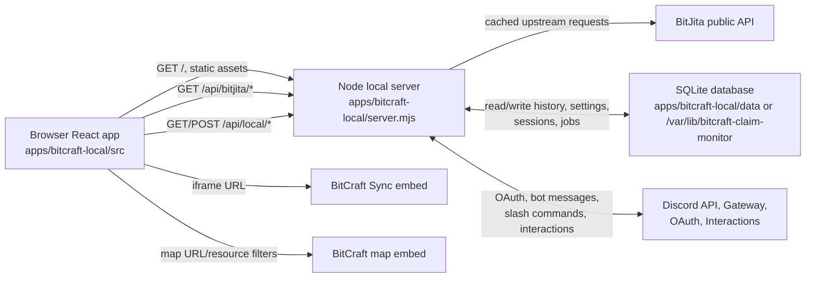
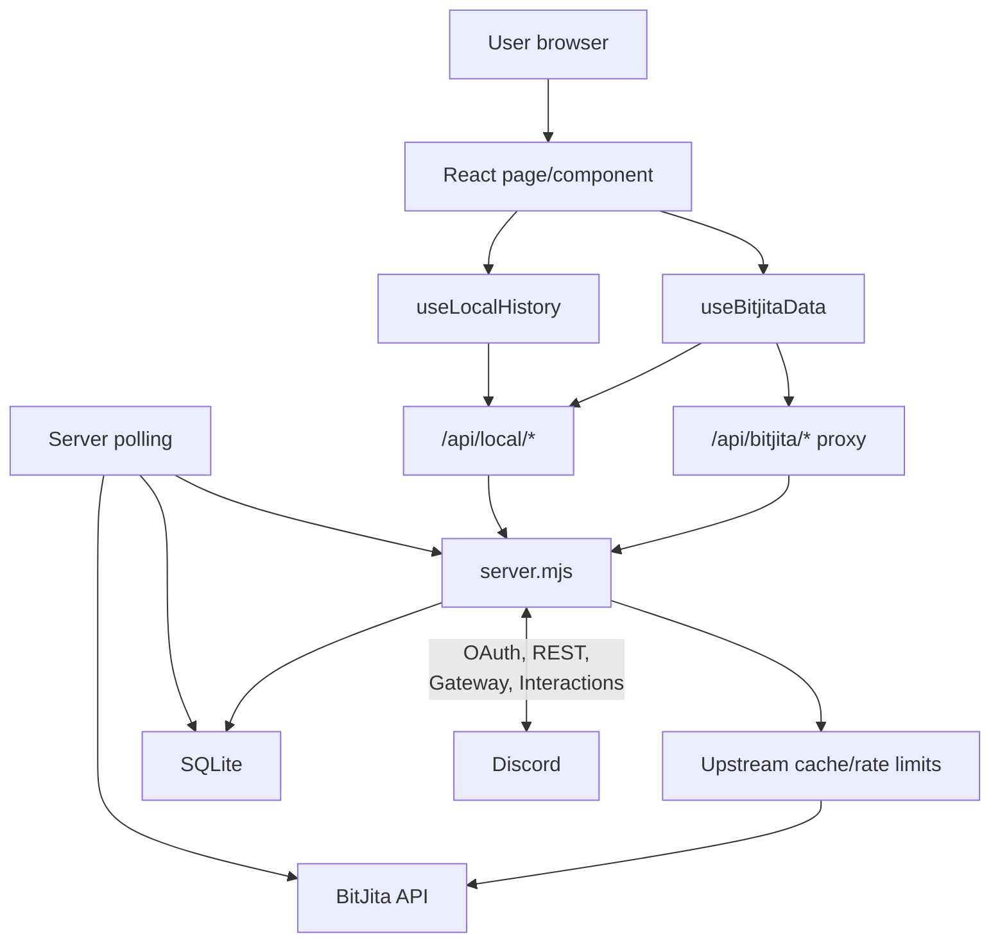
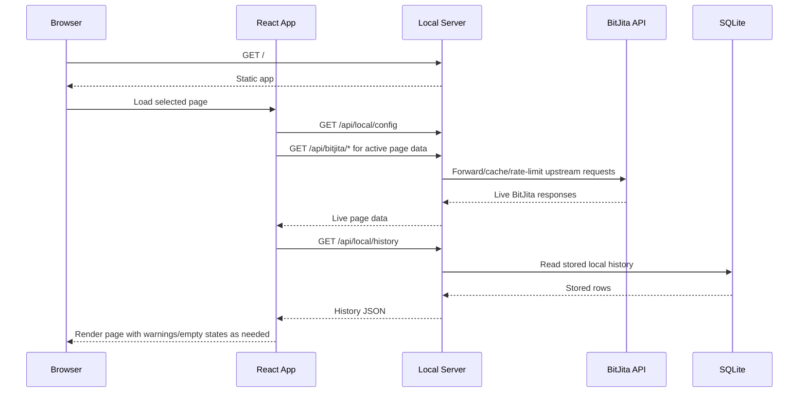
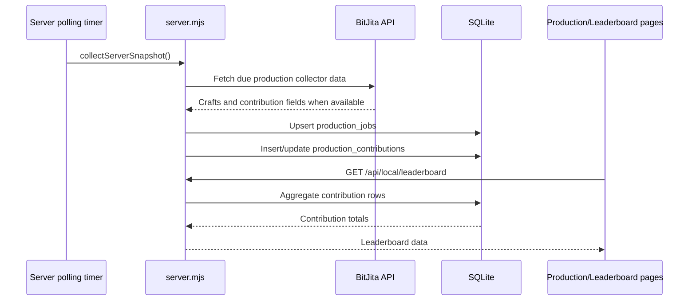
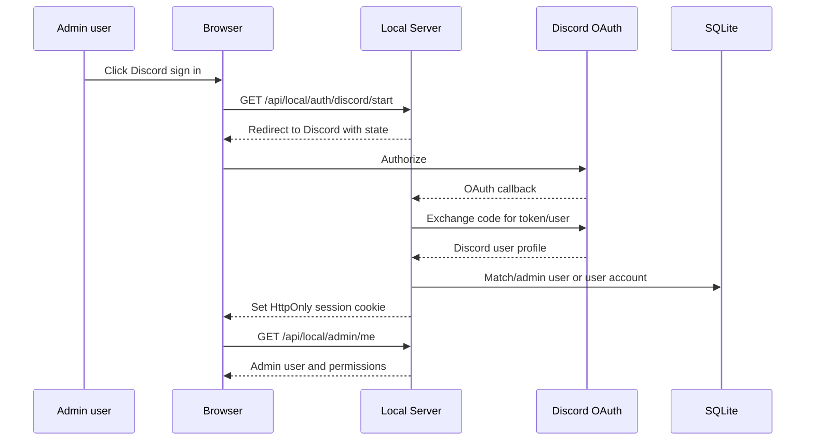
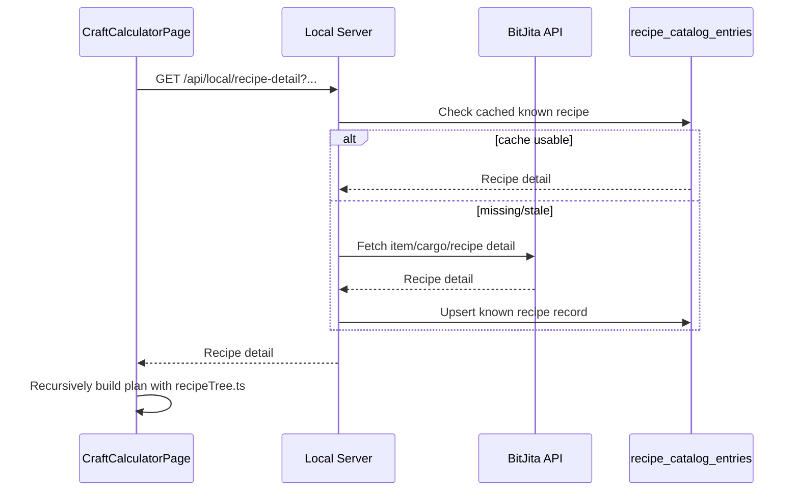

# Application Overview

BitCraft Claim Monitor is a local-first operations dashboard for a BitCraft settlement. The active app lives in `apps/bitcraft-local` and combines:

- a React/Vite frontend for public settlement monitoring, local settings, admin tools, and Discord bot controls;
- a Node HTTP server that serves the app, proxies BitJita requests, records SQLite history/cache data, runs background collection for history and notifications, and handles Discord integrations;
- a local SQLite database for market history, activity history, production contribution history, app settings, admin/user sessions, analytics, Discord diagnostics, scheduled jobs, cached regional buy orders, cached recipes, and collector diagnostics.

The main app is intended to display public BitJita game data for the selected settlement. Admin-only areas manage local app settings, jobs, stored data, Discord bot settings, moderation tools, branding, and user/account approvals.

For the maintained public API endpoint audit, current app coverage, and follow-up recommendations, see [BITJITA_API_AUDIT.md](../BITJITA_API_AUDIT.md).

## High-Level Architecture

### Runtime responsibilities

| Layer | Primary files | Responsibilities |
| --- | --- | --- |
| Frontend shell | `apps/bitcraft-local/src/main.tsx`, `src/AppShell.tsx`, `src/components/admin/AdminPanel.tsx`, `src/components/main/UserSettingsDialog.tsx` | React bootstrap, route selection, global refresh, app settings, admin console rendering, auth, local settings state and dialog, help/legal chrome, analytics consent, toasts, and notification drawer orchestration. |
| Routed pages | `apps/bitcraft-local/src/pages/*` | Feature-owned page modules for Dashboard, Activity, Inventory, Market, Map, Production, Public Craft Finder, and other routes. The legacy `MainPages.tsx` bundle has been removed. |
| Admin and bot dashboard components | `apps/bitcraft-local/src/components/admin/AdminPanel.tsx`, `src/components/admin/adminDisplay.ts`, `src/components/bot/*`, `src/styles/admin.css`, `src/styles/discord-admin.css`, `src/styles/bot-dashboard.css` | Shared admin console shell for `/?page=admin` and `/bot`, pure admin display helpers, plus individual bot dashboard tabs for setup, channels, notifications, role panels, colour roles, moderation, diagnostics, tests, safety, members, and role management, with dedicated admin, Discord section, and bot shell/navigation styles. |
| Shared frontend utilities | `apps/bitcraft-local/src/api/*`, `src/hooks/*`, `src/utils/*`, `src/main-app-data.ts`, `src/notifications/*` | BitJita/local fetch hooks, history hooks, normalization, formatting, ownership helpers, recipe tree building, market order parsing, item metadata helpers, notification generation, dedupe, settings normalization, and smoke-verification helpers. |
| Backend | `apps/bitcraft-local/server.mjs`, `src/server/*` | HTTP routing, static serving, BitJita proxy/cache/rate limits, SQLite migrations, auth, RBAC, domain collectors, history collection, Discord bot, scheduled jobs, and dependency-light helpers for HTTP policy, request/response handling, privacy, visitor-security settings normalization, notification activity redaction, deal-alert payload formatting, market deal-watch settings normalization, market activity normalization, production activity normalization, recipe catalog normalization, Discord settings normalization, collector settings normalization, and scheduled-job schedule handling. |
| Deployment | `deploy/*`, `DEPLOYMENT.md`, `LOCAL_DEV.md` | Caddy/systemd examples and local development guidance. |

## Page-by-Page Breakdown

Routes are query-string based through `ActivePanel` in `apps/bitcraft-local/src/types/app.ts`. The main route is `/?page=<panel>`. The Discord bot dashboard also has `/bot`.

### Route table

| Route | Page | Purpose | Primary frontend files | Auth |
| --- | --- | --- | --- | --- |
| `/?page=dashboard` | Dashboard | Settlement command-centre summary. | `src/pages/DashboardPage.tsx` (`Dashboard`) | Public |
| `/?page=leaderboard` | Leaderboard | Recorded settlement craft contribution by member/profession. | `src/pages/LeaderboardPage.tsx` (`Leaderboard`) | Public |
| `/?page=members` | Members | Settlement roster, online state, equipment, details. | `src/pages/MembersPage.tsx` | Public |
| `/?page=skills` | Professions | Profession levels, tiers, coverage. | `src/pages/SkillsPage.tsx` | Public |
| `/?page=production` | Production | Current crafts, member eligibility, passive crafts. | `src/pages/ProductionPage.tsx` (`Production`) | Public |
| `/?page=publiccrafts` | Public Craft Finder | Find public crafts by profession/region. | `src/pages/PublicCraftFinderPage.tsx` (`PublicCraftFinder`) | Public |
| `/?page=craftcalc` | Craft Calculator | Build recipe trees and material steps. | `src/pages/CraftCalculatorPage.tsx`, `src/utils/recipeTree.ts` | Public |
| `/?page=inventory` | Inventory | Containers and core material stock. | `src/pages/InventoryPage.tsx` (`Inventory`) | Public |
| `/?page=construction` | Construction | Active construction projects and material needs. | `src/pages/ConstructionPage.tsx` | Public |
| `/?page=research` | Research | Research/unlock state. | `src/pages/ResearchPage.tsx` | Public |
| `/?page=market` | Market | Listings, analytics, price finder, buy order finder. | `src/pages/MarketPage.tsx` (`Market`), `src/utils/marketOrders.ts` | Public |
| `/?page=empire` | Region | Regional settlement context and rankings. | `src/pages/RegionPage.tsx` | Public |
| `/?page=map` | Map | Embedded map with resource/player/region helpers. | `src/pages/MapPage.tsx` (`MapPanel`) | Public |
| `/?page=sync` | Sync | Optional BitCraft Sync embed. | `src/pages/SyncPage.tsx` | Public |
| `/?page=activity` | Activity | Stored local settlement activity history. | `src/pages/ActivityPage.tsx` (`ActivityPanel`) | Public |
| `/?page=admin` | Admin | Admin settings, jobs, users, data, analytics. | `src/components/admin/AdminPanel.tsx` | Admin session |
| `/bot` | Bot dashboard | Discord bot setup and server-management dashboard. | `src/components/admin/AdminPanel.tsx` bot mode, `src/components/bot/*` | Admin session with Discord permissions |

### Dashboard

- Route: `/?page=dashboard`
- Purpose: high-level settlement health and command-centre summary.
- Key components/functions: `Dashboard` in `src/pages/DashboardPage.tsx`; shared `DashboardMetric`, `DashboardCardHeader`, and `DashboardTrend` in `src/components/main/DashboardWidgets.tsx`.
- Data needs: claim summary, members, supply, treasury, construction count, production queue, online members, recent non-treasury/non-supply activity, snapshots/trends.
- Data source: frontend `useBitjitaData` refreshes live claim, member, production, construction, market and region data through the local `/api/bitjita/*` proxy; local history comes from `useLocalHistory` and `/api/local/history`.
- Fetching/transformation: frontend normalizers such as `normalizeData`, `claimSupplyRunOutAt`, `claimSupplyCap`, and formatting helpers from `main-app-data.ts` adapt live BitJita responses into dashboard-ready values.
- Actions: navigates to related pages using `onNavigate`.
- Auth: public.
- Loading/error/empty states: global BitJita warning banner displays partial refresh issues; chart and recent activity have empty states.
- Related files: `src/pages/DashboardPage.tsx`, `src/components/main/DashboardWidgets.tsx`, `src/api/bitjita.ts`, `src/api/localHistory.ts`, `src/main-app-data.ts`, `server.mjs`.

### Leaderboard

- Route: `/?page=leaderboard`
- Purpose: shows recorded craft contribution totals by member and profession.
- Key components/functions: `Leaderboard` in `src/pages/LeaderboardPage.tsx`; backend `/api/local/leaderboard`.
- Data needs: `production_contributions`, production job metadata, member/profession filters.
- Data source: local SQLite only, populated by server polling from BitJita production contribution data.
- Fetching/transformation: frontend fetches the local leaderboard endpoint; backend combines stored contribution rows, local market/activity history, and current live member/player data where needed.
- Actions: profession filter.
- Auth: public.
- Loading/error/empty states: page-level loading and empty states.
- Related files: `src/pages/LeaderboardPage.tsx`, `server.mjs`.
- Needs review: contribution accuracy depends on BitJita returning contribution data. The app intentionally should not infer contribution from progress changes.

### Members

- Route: `/?page=members`
- Purpose: member list, online state, access summaries, equipment/tool details, quests/passive crafts.
- Key components/functions: `Members` in `src/pages/MembersPage.tsx`; `normalizePlayer`, equipment helpers in `src/utils/items.ts`.
- Data needs: claim members, citizens/professions, player detail/equipment data, storage/build access, settlement owner.
- Data source: BitJita claim member/citizen endpoints through `useBitjitaData`; detail lookups through `/api/local/player-details`.
- Fetching/transformation: `normalizeData` and `normalizePlayer` flatten BitJita wrapper shapes; equipment presets are normalized from player detail responses.
- Actions: click member row to open details.
- Auth: public.
- Loading/error/empty states: global loading from `useBitjitaData`; detail pane fallback when equipment or detail data is missing.
- Related files: `src/pages/MembersPage.tsx`, `src/api/bitjita.ts`, `src/utils/normalize.ts`, `src/utils/items.ts`.

### Professions

- Route: `/?page=skills`
- Purpose: profession levels, tier coverage, member strengths, and settlement coverage.
- Key components/functions: `Skills` in `src/pages/SkillsPage.tsx`.
- Data needs: citizens/member profession levels, skill reference data.
- Data source: `/claims/:claimId/citizens` and `/skills` through `useBitjitaData`.
- Fetching/transformation: `normalizeData` provides citizens and members; profession names/tier calculations are derived in the page.
- Actions: table/filter interactions.
- Auth: public.
- Loading/error/empty states: empty states when no profession data is present.
- Related files: `src/pages/SkillsPage.tsx`, `src/api/bitjita.ts`, `src/utils/professions.ts`.

### Production

- Route: `/?page=production`
- Purpose: active settlement crafting jobs, passive crafts, member filter/eligibility, private-craft visibility.
- Key components/functions: `Production` and `MemberPassiveCrafts` in `src/pages/ProductionPage.tsx`; backend `/api/local/production/crafts`; production metric helpers in `src/pages/production/productionUtils.ts`; item/tool helpers in `src/utils/items.ts`.
- Data needs: claim crafts, members, citizens/professions, member details/toolbelt where available, passive craft output.
- Data source: direct BitJita `/crafts?claimEntityId=...&completed=false` plus local `/api/local/production/crafts`; passive crafts from `/api/local/passive-crafts`.
- Fetching/transformation: `useBitjitaData` first fetches baseline BitJita endpoints, then posts member data to `/api/local/production/crafts` to enrich with player/crafter details and contribution records. Errors from this enrichment are added as partial errors rather than blanking the whole page.
- Actions: member filter, sort/direction, show private crafts toggle.
- Auth: public.
- Loading/error/empty states: global refresh warning banner; production empty state when no active jobs; partial error if local production enrichment fails.
- Related files: `src/pages/ProductionPage.tsx`, `src/pages/production/productionUtils.ts`, `src/api/bitjita.ts`, `server.mjs`, `src/utils/items.ts`.
- Needs review: BitJita can temporarily report stale/missing craft contribution fields; the app should avoid inventing fallback contribution.

### Public Craft Finder

- Route: `/?page=publiccrafts`
- Purpose: locate public crafts by profession and region.
- Key components/functions: `PublicCraftFinder` in `src/pages/PublicCraftFinderPage.tsx`.
- Data needs: public craft list, active region options, profession filter, settlement/map focus metadata.
- Data source: BitJita craft endpoints through `/api/bitjita/*`, active regions through `/api/local/regions/active`.
- Fetching/transformation: component filters public crafts by selected profession/region and can pass settlement focus to the routed Map page.
- Actions: profession filter, region filter, click settlement/location to open map.
- Auth: public.
- Loading/error/empty states: local loading/error states in component.
- Related files: `src/main.tsx`, `server.mjs`.

### Craft Calculator

- Route: `/?page=craftcalc`
- Purpose: create a recipe tree and step plan for an item/cargo quantity.
- Key components/functions: `CraftCalculatorPage` in `src/pages/CraftCalculatorPage.tsx`; `buildRecipePlan` and related helpers in `src/utils/recipeTree.ts`.
- Data needs: item/cargo search results, recipe detail, recursive ingredient recipes, quantity.
- Data source: `/api/bitjita/*` for search/reference data and `/api/local/recipe-detail` for local recipe detail lookup/cache.
- Fetching/transformation: the frontend recursively resolves recipes where BitJita exposes them. Server stores known recipe details in `recipe_catalog_entries`; the `recipe_catalog_refresh` scheduled job refreshes known records once per day at midnight.
- Actions: item search, amount input, recipe variant dropdown when multiple recipes exist.
- Auth: public.
- Loading/error/empty states: local error if a recipe branch cannot be fetched; source-material fallback when no recipe is exposed.
- Related files: `src/pages/CraftCalculatorPage.tsx`, `src/utils/recipeTree.ts`, `server.mjs`.
- Needs review: the catalog is not a guaranteed complete recipe database; it refreshes known records rather than crawling all possible BitJita recipes.

### Craft Planning

- Route: `/?page=planning`
- Purpose: show an admin-controlled procurement board for settlement goals, grouped by activity and tier, with counted settlement storage, selected player inventories, deployables, and active crafts.
- Key components/functions: `CraftPlanningPage` in `src/pages/CraftPlanningPage.tsx`; `computeCraftPlan` and related helpers in `src/server/craftPlanning.mjs`; source normalization in `src/server/craftPlanSources.mjs`.
- Data needs: configured target items, selected storage/player/deployable sources, active crafts, recipe detail records, item/cargo metadata, and route overrides.
- Data source: `/api/local/craft-plan` for the read-only board and `/api/local/admin/craft-plan` for admin configuration; BitJita `/api/items/{id}`, `/api/cargo/{id}`, and `/api/cargo` provide authoritative metadata and cargo derivation candidates.
- Fetching/transformation: server-side planning must use BitJita `tag` and `tier` from item/cargo detail data for board grouping. Inventory stack `itemType` remains part of the key: `0` resolves through `/api/items/{id}` and `1` resolves through `/api/cargo/{id}`. Cargo-derived production such as Trunk to Wood Log is discovered from the BitJita cargo catalog plus cargo/item detail routes and `itemListPossibilities`, not from hardcoded item-name parsing.
- Actions: admins manage targets, storage/player/deployable sources, tier presets, route choices, buffers, and row section overrides; ordinary users view the computed board.
- Auth: public read; admin mutations require existing admin permissions.
- Loading/error/empty states: source failures are reported as unavailable sources and excluded from available-stock totals rather than blocking the whole plan.
- Related files: `src/pages/CraftPlanningPage.tsx`, `src/server/craftPlanning.mjs`, `src/server/craftPlanSources.mjs`, `server.mjs`.
### Inventory

- Route: `/?page=inventory`
- Purpose: display container contents and core material stock.
- Key components/functions: `Inventory` in `src/pages/InventoryPage.tsx`; material and item image helpers in `src/utils/items.ts`.
- Data needs: inventories/containers, item quantities, core material identification.
- Data source: `/claims/:claimId/inventories` through `useBitjitaData`.
- Fetching/transformation: inventory data is normalized from BitJita wrappers, grouped by container, and filtered by selected material/category controls.
- Actions: filter containers by core material, search/filter container contents.
- Auth: public.
- Loading/error/empty states: empty state when no inventory data is available.
- Related files: `src/main.tsx`, `src/api/bitjita.ts`, `src/utils/items.ts`.

### Construction

- Route: `/?page=construction`
- Purpose: active construction projects and material requirements.
- Key components/functions: `Construction` in `src/pages/ConstructionPage.tsx`; construction helpers in `src/main-app-data.ts`.
- Data needs: construction projects, required materials, added materials, inventory/storage availability.
- Data source: `/claims/:claimId/construction` and `/claims/:claimId/inventories` through `useBitjitaData`.
- Fetching/transformation: page derives material-added progress, remaining needs, and gather-next summaries from BitJita construction fields and inventory stock.
- Actions: project display/filtering.
- Auth: public.
- Loading/error/empty states: empty state when no construction projects are active.
- Related files: `src/pages/ConstructionPage.tsx`, `src/main-app-data.ts`, `src/api/bitjita.ts`.
- Needs review: material accuracy depends on BitJita exposing added/required material fields consistently for construction projects.

### Research

- Route: `/?page=research`
- Purpose: show settlement research/unlock state.
- Key components/functions: `Research` in `src/pages/ResearchPage.tsx`.
- Data needs: research entries/unlocks.
- Data source: `/claims/:claimId/research` through `useBitjitaData`.
- Fetching/transformation: page derives totals and lists from normalized research response.
- Actions: none significant beyond page viewing.
- Auth: public.
- Loading/error/empty states: empty state when no research data is present.
- Related files: `src/pages/ResearchPage.tsx`, `src/api/bitjita.ts`.

### Market

- Route: `/?page=market`
- Purpose: live settlement listings, market analytics, price finder, and buy order finder.
- Key components/functions: `Market` in `src/pages/MarketPage.tsx`; `PriceFinder` in `src/pages/market/PriceFinder.tsx`; `BuyOrderFinder` in `src/pages/market/BuyOrderFinder.tsx`; market helpers in `src/pages/market/*` and `src/utils/marketOrders.ts`.
- Data needs: current claim market listings, listing events/trades, price history, buy orders, item search.
- Data source: `/claims/:claimId/market/listings` through `useBitjitaData`; local market history through `/api/local/history` and SQLite tables; price/order endpoints through `/api/bitjita/*`.
- Fetching/transformation: frontend paginates all claim market listings in `requestAllMarketListings`; backend polling stores listings, events, trades, and sale/removal transitions.
- Actions: tab switching, member filter, pricing item search, buy order region filter.
- Auth: public.
- Loading/error/empty states: tab-specific empty states; API warning banner for failed refreshes.
- Related files: `src/pages/MarketPage.tsx`, `src/pages/market/*`, `src/api/bitjita.ts`, `src/api/localHistory.ts`, `src/utils/marketOrders.ts`, `server.mjs`.
- Needs review: sales/removal classification depends on BitJita listing and trade history fields. Avoid implying certainty where BitJita does not expose buyer/seller fields.

### Region

- Route: `/?page=empire`
- Purpose: regional settlement statistics, rankings, nearby settlements, region wealth.
- Key components/functions: `Region` in `src/pages/RegionPage.tsx`.
- Data needs: current claim region, regional claim list, settlement owners, treasuries, supplies, trade volume where available.
- Data source: claim and region data from `useBitjitaData` through the local `/api/bitjita/*` proxy, with slower background region payloads retained for history and diagnostics.
- Fetching/transformation: frontend sorts/renders live regional responses and uses local history/cache endpoints only where the page needs retained data.
- Actions: sorting/filtering where available.
- Auth: public.
- Loading/error/empty states: local loading/error/empty states for regional data.
- Related files: `src/pages/RegionPage.tsx`, `server.mjs`, `src/api/bitjita.ts`.

### Map

- Route: `/?page=map`
- Purpose: embedded map with active regions, resource finder, player/settlement focus.
- Key components/functions: `MapPanel` in `src/pages/MapPage.tsx`.
- Data needs: claim region, members/player IDs, resource/catalog data, active regions.
- Data source: local `/api/local/map/catalog` and `/api/local/regions/active`, plus BitJita resource/creature data through server helpers.
- Fetching/transformation: component builds an external map URL with `resourceId`, `playerId`, and `regionId` query parameters.
- Actions: region selection, resource search/category filter, collapse resource finder, map focus from public crafts.
- Auth: public.
- Loading/error/empty states: resource finder fallback states.
- Related files: `src/main.tsx`, `server.mjs`.

### Sync

- Route: `/?page=sync`
- Purpose: embed a configured BitCraft Sync page.
- Key components/functions: `SyncPanel` in `src/pages/SyncPage.tsx`.
- Data needs: configured sync URL.
- Data source: app settings from `/api/local/config`; no BitJita data required for the embed itself.
- Fetching/transformation: no internal transformation beyond validating/passing the configured URL.
- Actions: iframe navigation to external BitCraft Sync content.
- Auth: public.
- Loading/error/empty states: prompts user to configure a URL if one is not set.
- Related files: `src/pages/SyncPage.tsx`, `src/main.tsx`, `server.mjs`.

### Activity

- Route: `/?page=activity`
- Purpose: local historical activity feed for the tracked settlement.
- Key components/functions: `ActivityPanel` in `src/main.tsx`.
- Data needs: stored activity events, filters, member list.
- Data source: `/api/local/activity` and `/api/local/history`, backed by SQLite `activity_events`.
- Fetching/transformation: server polling records settlement-scoped events; frontend filters/searches the stored events.
- Actions: filter by event type/member.
- Auth: public.
- Loading/error/empty states: readable error state for local history fetch issues and empty state when no activity is recorded.
- Related files: `src/main.tsx`, `src/api/localHistory.ts`, `server.mjs`.

### Admin

- Route: `/?page=admin`
- Purpose: admin control panel for app settings, data, users, jobs, backups, analytics, and maintenance.
- Key components/functions: `AdminPanel` in `src/components/admin/AdminPanel.tsx`; admin endpoints in `server.mjs`; Discord settings normalization in `src/server/discordSettings.mjs`.
- Data needs: admin session, settings, jobs, polling diagnostics, user accounts, tables, analytics, audit log.
- Data source: `/api/local/admin/*` routes, backed by SQLite.
- Fetching/transformation: frontend fetches admin status/settings after authenticated session; server applies RBAC permissions through `adminPermissionFor`, `requireAdminPermission`, and role permissions.
- Actions: manage settings, branding, jobs, users, data export/prune, Discord settings depending on permissions.
- Auth: admin session.
- Loading/error/empty states: admin sign-in screen, permission-aware content, request result panels.
- Related files: `src/main.tsx`, `server.mjs`, `src/components/main/*`.

### Bot Dashboard

- Route: `/bot`
- Purpose: Discord bot control dashboard and server-management tools.
- Key components/functions: `AdminPanel` in bot mode and components under `src/components/bot/*`.
- Data needs: Discord settings, channel/role/member discovery, role panels, moderation settings, diagnostics, delivery logs, test actions.
- Data source: `/api/local/admin/discord/*` routes and Discord API calls from `server.mjs`.
- Fetching/transformation: frontend renders dedicated bot sections; server persists normalized settings and uses Discord REST/Gateway/interactions.
- Actions: configure bot token/app/guild, discover channels/roles/members, send test notifications, post/update panels, manage colour roles, moderation tools, diagnostics.
- Auth: admin session with `discord.view`, `discord.manage`, or `discord.moderate` permissions depending on action.
- Loading/error/empty states: per-section status/results panels.
- Related files: `src/main.tsx`, `src/components/bot/*`, `server.mjs`.
- Needs review: this bot is currently integrated into the same app/server. If it becomes private/separate later, API boundaries should be documented separately.

## Data Flow

### Major data types and entities

| Entity | Source of truth | Stored locally | Notes |
| --- | --- | --- | --- |
| Claim/settlement | BitJita `/claims/:claimId` | `snapshots`, `domain_payload_current` | Core settlement identity, region, treasury, supplies. Normal pages render from live proxy responses. |
| Members/citizens | BitJita `/claims/:claimId/members`, `/citizens` | `domain_payload_current` for background diagnostics/history context | Used for roster, professions, owner crown, player details. |
| Player details/equipment | BitJita player endpoints through server helpers | `domain_payload_current` for background diagnostics/history context | Used for online state, playtime, equipment and eligibility display. |
| Crafts/production jobs | BitJita `/crafts` and local enrichment | `production_jobs`, `production_contributions`, `domain_payload_current` | Contributions are stored only when BitJita reports them. |
| Market listings/events/trades | BitJita market endpoints and server polling | `market_listings`, `market_events`, `market_trades` | Used for market analytics, sales history, price tools. |
| Activity events | BitJita/log endpoints and server polling | `activity_events` | Settlement-scoped local historical feed. |
| Construction/research/inventory | BitJita claim endpoints | `domain_payload_current` for background diagnostics/history context | Displayed from live proxy responses and used in summary calculations. |
| Region status/claims | BitJita region endpoints | `domain_payload_current` for background diagnostics/history context | Used by Region, Map and regional summary views. |
| Recipe details | BitJita recipe/item/cargo endpoints | `recipe_catalog_entries` | Local cache of known recipe records; refreshed by scheduled job. |
| App settings/secrets | Admin UI/server | `app_settings`, `app_secrets` | Secrets should not be returned to frontend. |
| Admin/users/sessions | Discord OAuth/admin routes | `admin_users`, `admin_sessions`, `user_accounts`, `user_sessions` | Admin RBAC and optional public Discord login. |
| Discord bot diagnostics | Discord send/interaction handlers | `discord_delivery_log`, bot-related tables | Used for troubleshooting notifications and moderation tools. |

### Fetching and transformation pattern

1. `DashboardApp` chooses the active page from the `page` query parameter.
2. `useBitjitaData(refreshToken, claimId, activePanel)` requests the live BitJita endpoints needed by the active page through the same-origin `/api/bitjita/*` proxy.
3. The server-side `/api/bitjita/*` proxy applies origin restrictions, caching, local rate limits and upstream request headers before forwarding to BitJita.
4. Local helper endpoints are still used where the app needs retained history, notifications, recipe cache, regional buy-order cache, player detail enrichment, or diagnostics.
5. `normalizeData`, `unwrap`, `toNumber`, and page-specific utilities adapt live BitJita responses to UI-friendly structures.
6. `useLocalHistory` loads stored market/activity/snapshot/dashboard history from `/api/local/history`.
7. Background collection in `collectServerSnapshot` supports history, notifications, analytics, recipes, regional buy-order cache and diagnostics. It is not the normal page-rendering source of truth.

## Important User Flows

### Public page load and refresh

Key files:

- `src/main.tsx` (`DashboardApp`)
- `src/api/bitjita.ts`
- `src/api/localHistory.ts`
- `server.mjs`

### Production contribution recording

Accuracy requirement: if BitJita does not report contribution fields, the app should show missing/unavailable contribution rather than infer it from progress.

### Discord admin login

Key files/functions:

- `server.mjs`: OAuth routes, session helpers, `requireAdmin`, `adminPermissionFor`
- `src/main.tsx`: admin sign-in/settings UI

### Craft calculator recipe lookup

Key files:

- `src/pages/CraftCalculatorPage.tsx`
- `src/utils/recipeTree.ts`
- `server.mjs` scheduled job and `/api/local/recipe-detail`

### Admin setting mutation

1. Admin UI fetches `/api/local/admin/me` and `/api/local/admin/settings`.
2. Mutating requests include CSRF/session requirements handled by `server.mjs`.
3. `requireAdminPermission` checks the route-specific permission from `adminPermissionFor`.
4. Server persists settings/secrets in SQLite.
5. Frontend updates local app settings and refresh tokens where needed.

## Components and Responsibilities

### Frontend shell and navigation

- `DashboardApp` in `src/main.tsx`: active page state, sidebar grouping, refresh timer, settings/help/update dialogs, warnings, floating dock, footer.
- `NAV_GROUPS` in `src/main.tsx`: grouped public navigation.
- `ActivePanel` in `src/types/app.ts`: valid page IDs.

### Data hooks

- `useBitjitaData` in `src/api/bitjita.ts`: page-aware BitJita/local data loader.
- `useLocalHistory` in `src/api/localHistory.ts`: local history loader for activity, market, snapshots, and dashboard history.
- Other hooks under `src/hooks/*`: browser settings, analytics, and UI-oriented state. Inspect the specific hook before changing its persistence behavior.

### Normalization and utilities

- `src/main-app-data.ts`: generic unwrap/number/date helpers and claim/construction helpers.
- `src/utils/normalize.ts`: normalizes BitJita response wrappers and player data.
- `src/utils/items.ts`: item image URLs, rarity/tier helpers, equipment/tool slot helpers.
- `src/utils/recipeTree.ts`: recursive recipe plan construction.
- `src/utils/marketOrders.ts`: buy order normalization and sorting.
- `src/utils/ownership.ts`: tracked owner display logic.
- `src/utils/format.ts`: common formatting helpers.

### Backend services

`server.mjs` currently owns several responsibilities in one file:

- SQLite schema creation and lightweight migrations through `CREATE TABLE IF NOT EXISTS` and `ensureColumn`.
- HTTP routing for public local APIs, admin APIs, auth, Discord interactions, and BitJita proxying.
- Security headers, body limits, rate limits, CSRF/session checks, and RBAC.
- BitJita upstream cache and endpoint-specific cache TTL policies.
- Server polling through `collectServerSnapshot`.
- Discord bot settings, delivery, gateway, slash commands, interactions, role panels, moderation, diagnostics.
- Scheduled job registry and runner, currently including `recipe_catalog_refresh`.

This concentration is functional but is one of the highest-complexity areas in the app.

## Configuration and Environment Variables

| Variable | Used by | Purpose | Default/notes |
| --- | --- | --- | --- |
| `NODE_ENV` | Server/frontend tooling | Runtime environment. | Common values: `development`, `production`. |
| `BITCRAFT_TEST` | Server | Test-mode guard. | Used to avoid some production behavior in tests. |
| `SERVE_STATIC` | Server | Serve built frontend from `dist`. | Used by smoke/production-style server. |
| `APP_HOST` | Server | Bind host for app server. | Smoke server uses `127.0.0.1`. |
| `APP_PORT` | Server | App/static server port. | Smoke server uses `18449`; production commonly proxies `18430`. |
| `LOCAL_API_PORT` | Dev server | Local API port in dev mode. | Common default is `18430`. |
| `BITCRAFT_LOCAL_DATA_DIR` | Server | SQLite/runtime data directory. | Dev may use `apps/bitcraft-local/data` or `.dev-data`; production uses `/var/lib/bitcraft-claim-monitor`. |
| `BITJITA_API_ORIGIN` | Server | BitJita API origin override. | Defaults to BitJita public API origin in code. |
| `BITJITA_APP_IDENTIFIER` | Server | App identifier/user-agent style metadata for BitJita requests. | Optional but useful for upstream identification. |
| `BITJITA_PROXY_CACHE_MS` | Server | Default upstream proxy cache TTL. | Falls back to code default. |
| `BITJITA_PROXY_CACHE_MAX_ENTRIES` | Server | In-memory upstream cache size. | Falls back to code default. |
| `ENABLE_SERVER_POLLING` | Server | Enables background snapshot/history polling. | Production should generally keep enabled. |
| `SNAPSHOT_INTERVAL_MS` | Server | Poll interval. | Must be balanced against BitJita rate limits. |
| `PRODUCTION_MISSING_GRACE_MS` | Server | Grace window around missing production jobs. | Used to reduce false disappearance/completion handling. |
| `ENABLE_SCHEDULED_JOBS` | Server | Enables scheduled job runner. | Controls jobs such as recipe catalog refresh. |
| `RECIPE_CATALOG_REFRESH_LIMIT` | Server | Limits recipe catalog refresh batch size. | Prevents daily job from overloading BitJita. |
| `ENABLE_DISCORD_STARTUP` | Server | Starts Discord bot gateway/startup behavior. | Smoke server disables this. |
| `DISCORD_BOT_TOKEN` | Server | Discord bot token. | Secret; must never be exposed or committed. |
| `DISCORD_APPLICATION_ID` | Server | Discord application/client ID for bot interactions. | Required for slash command registration/interactions. |
| `DISCORD_PUBLIC_KEY` | Server | Verifies Discord interaction signatures. | Required for `/api/discord/interactions`. |
| `DISCORD_GUILD_ID` | Server | Target Discord server/guild. | Required for many bot discovery/actions. |
| `DISCORD_CHANNEL_ID` | Server | Legacy/default Discord channel. | Some settings now use configured channel IDs instead. |
| `DISCORD_OAUTH_CLIENT_ID` | Server | Discord OAuth app client ID. | Required for Discord login. |
| `DISCORD_OAUTH_CLIENT_SECRET` | Server | Discord OAuth secret. | Secret; store in env or app secrets. |
| `DISCORD_OAUTH_REDIRECT_URI` | Server | OAuth callback URL. | Must match Discord developer portal. |
| `DEFAULT_OWNER_DISCORD_ID` | Server | Bootstrap/default owner Discord ID. | Used for default admin owner setup. |
| `ADMIN_SETUP_KEY` | Server | One-time admin bootstrap key. | Production bootstrap only; remove after setup. |
| `ENABLE_LEGACY_ADMIN_PASSWORD_AUTH` | Server | Re-enable legacy password admin login. | Should normally remain disabled. |
| `SOURCE_VERSION` | Server | App version for notifications/status. | Often from package/version environment. |
| `RENDER_GIT_COMMIT` / `GITHUB_SHA` | Server | Git revision for app update notification release keys. | Used where available. |

Needs review: this table is based on current `server.mjs` environment reads. Deployment-specific defaults may also be set by systemd, shell scripts, or VPS configuration outside the repo.

## External Integrations

### BitJita API

- Used for public BitCraft/settlement data, members, citizens, crafts, market, inventories, construction, research, map/resource catalogs, recipes, and player details.
- Browser calls go through `/api/bitjita/*`; the server applies cache and rate-limit policies before upstream requests.
- Relevant files: `src/api/bitjita.ts`, `server.mjs`, `BITJITA_API_AUDIT.md`.
- Accuracy rule: prefer real BitJita fields over inference. If a field is missing or ambiguous, show conservative UI or mark as unavailable.
- Inventory stack rule: `itemType`/`item_type` identifies the catalog family. `0` is a regular item (`/api/items/{id}`), `1` is cargo (`/api/cargo/{id}`). Preserve this as `kind: "items" | "cargo"` in normalized data and UI labels where mixed inventories are shown.

### Discord

- Used for admin/user OAuth login, Discord bot notifications, slash commands, interaction buttons, role management, moderation utilities, diagnostics, and server discovery.
- Relevant files: `server.mjs`, `src/components/bot/*`, `src/main.tsx`.
- Admin actions that mutate Discord should remain permission-gated and should not expose bot tokens.

### BitCraft Sync

- Optional external embed configured by app settings.
- Relevant file: `src/pages/SyncPage.tsx`.
- If no URL is configured, users should be prompted rather than shown a broken embed.

### BitCraft map / map resource URLs

- Map page builds an external map URL with selected `regionId`, `resourceId`, and `playerId` values.
- Relevant files: `src/main.tsx`, `server.mjs`.

### GitHub and support links

- Footer/help links reference GitHub, issues/feature requests, changelog/readme/terms/privacy where configured.
- Buy Me a Coffee support link/button is displayed in the footer.

## Permissions and Security

### Public vs admin data

- Public BitJita game data is intended to be visible without admin login.
- Admin-only data includes app configuration, secrets, admin/session/user management, analytics, database table browsing, backups/maintenance, and Discord bot controls.

### Admin roles

Defined in `server.mjs` as `ADMIN_ROLE_LABELS` and `ADMIN_ROLE_PERMISSIONS`:

| Role | Main access |
| --- | --- |
| `owner` | All permissions (`*`). |
| `admin` | Status, settings, data view/export/manage, user account management, analytics, audit, Discord view/manage/moderate. |
| `discord-manager` | Status, settings view, Discord view/manage. |
| `moderator` | Status, settings view, Discord view/moderate, audit view. |
| `viewer` | Status, settings view, data view, analytics view, audit view, Discord view. |

Route permissions are mapped by `adminPermissionFor` in `server.mjs`.

### Session and mutation protection

- Admin and user sessions are server-side and stored in SQLite with HttpOnly cookies.
- Admin mutations are protected by admin session checks and route permissions.
- The server includes route-specific body limits through `BODY_LIMITS`.
- The server applies local rate limits for auth, analytics, Discord interactions, BitJita proxy, and expensive local endpoints.
- Discord interactions should be verified with the Discord public key before handling.

### Secrets

- Discord bot tokens, OAuth client secrets, setup keys, sessions, and app secrets must not be committed or returned to public APIs.
- SQLite runtime databases and uploaded branding/backups should remain outside Git.

## Known Complexity / Risk Areas

1. `server.mjs` is a high-risk file because it combines routing, schema migrations, polling, BitJita proxying, auth, Discord bot logic, scheduled jobs, and diagnostics.
2. `src/AppShell.tsx` is now focused on top-level browser orchestration after page, admin, notification, and user-settings extractions. `src/components/admin/AdminPanel.tsx` is still large and should be split further only along stable admin tab/helper boundaries.
3. BitJita response shapes are adapted from observed wrappers and endpoints. `unwrap`, `normalizeData`, and page logic handle several possible nesting patterns, but field semantics can still change upstream.
4. Production contribution must come from BitJita. Fallback inference from craft progress would be misleading and should be avoided.
5. Market sale/removal analytics depend on listing/trade fields being available and stable. Buyer/seller details may be missing for some endpoints.
6. Craft Calculator recursion can be expensive if it has to fetch many recipe branches. The recipe catalog helps for known records but is not a complete offline data mirror.
7. Discord bot actions can mutate a live server. Tests should avoid live sends/role changes unless explicitly requested.
8. Admin and bot UI share the same app bundle and server. If the bot becomes private or separately deployed, this boundary needs a deliberate split.
9. Browser local settings, cookies, Discord user sessions, and admin sessions overlap conceptually but have different persistence and privacy expectations.
10. Rate limiting and caching must be tuned carefully. Counting cached responses as upstream pressure or fan-out from new pages can create false 429 problems.

## Suggested Future Documentation

- `docs/bitjita-endpoints.md`: endpoint-by-endpoint field notes and observed response examples.
- `docs/database-schema.md`: table purpose, important columns, retention policy, and migration rules.
- `docs/discord-bot.md`: bot setup, permissions, OAuth, interaction IDs, notification rules, and diagnostics.
- `docs/admin-rbac.md`: admin roles, permissions, and route matrix.
- `docs/polling-and-jobs.md`: background polling, scheduled jobs, rate limits, and failure modes.
- `docs/frontend-pages.md`: ownership map for each page/component after further frontend modularization.
- `docs/deployment-runbook.md`: production update script, rollback, backup, Caddy, and systemd troubleshooting.
- `docs/privacy-operations-runbook.md`: legal configuration, data-rights requests, deletion-ledger recovery, encrypted backups, incidents, and retention operations.

## Legal And Privacy Controls

The service is operated worldwide for adults aged 18+ by Thomas Bush, operating as Timbersteel Claim Monitor (a project/trading name, not a separate company). Discord sign-in requires current Terms acceptance and age confirmation. Analytics remains optional and separately consented.

Authenticated users can download a scoped JSON export; unlink a character; clear synced preferences, market watches/alerts, or current-browser analytics; and permanently delete their ordinary app account after recent matching Discord reauthentication. A separate administrator identity is intentionally preserved. Completed deletion is written to an independently retained signed ledger and replayed at startup so an older SQLite restore cannot silently recreate an account.

Production backups are AES-256-GCM encrypted and require protected external key files. Runtime keys and the current deletion ledger must not be stored in SQLite or rolled back with the selected database recovery point.
- `docs/testing.md`: browser smoke server, test commands, and regression areas.

## Accuracy Requirements

- This document is based on the current repository code, especially:
  - `apps/bitcraft-local/src/main.tsx`
  - `apps/bitcraft-local/src/api/bitjita.ts`
  - `apps/bitcraft-local/src/api/localHistory.ts`
  - `apps/bitcraft-local/src/pages/*`
  - `apps/bitcraft-local/src/components/bot/*`
  - `apps/bitcraft-local/src/utils/*`
  - `apps/bitcraft-local/src/main-app-data.ts`
  - `apps/bitcraft-local/server.mjs`
  - `BITJITA_API_AUDIT.md`
- Do not treat this as a replacement for live BitJita API validation. If the code and live API disagree, verify against the live response before changing calculations or labels.
- Any statement marked "Needs review" is intentionally not asserted as a hard fact.
- If future refactors move pages out of `main.tsx` or split `server.mjs`, update this document in the same change.

